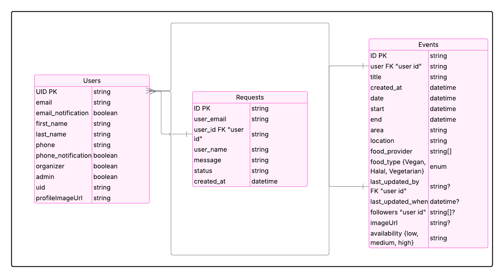

# Spark-Bytes

Design: https://www.figma.com/design/9jU7k7CNZNfiiMY8r0wk0X/Spark!Bytes?node-id=0-1&p=f&t=aqQ4WG066qGEnzTR-0

Deployed Website: https://spark-bytes-t8.vercel.app/

# Project Overview

Welcome to the Spark-Bytes project! This project is a web application designed for bu students to post and follow events so that they can take advantage of free food and avoid wasting food. The application allows users to create, view, and manage events, making it easier for students to connect and share resources.

# Tech Stack
- **Frontend**: React, Next.js, TypeScript
- **Backend**: Node.js, Firebase, Google Cloud Functions
- **Database**: Firestore (noSQL)

# Database Structure


# Quick Start dev guide
1. Clone the repository:
```bash
git clone git@github.com:Senahilal/Spark-Bytes.git
```

2. install dependencies:
navigate to Spark-Bytes/spark-bytes and run:
```bash
npm install
```

3. Start the development server:
```bash
npm run dev
```
4. Open your browser and go to:
```bash
http://localhost:3000
```
5. You can now start developing your application! The development server will automatically reload when you make changes to the code.
6. To run the tests, navigate to the root directory of the project and run, Spark-Bytes/spark-bytes:
```bash
npm test
```

# Quick Start Deploy guide
1. after you have completed the development and testing of your application, you can push your changes to the branch you are working on, separate from the main branch, then open a pull request to merge your changes into the main branch. Do not merge the pull request until Vercel verification is complete:
```bash
git add .
git commit -m "your commit message"
git push origin your-branch-name
```
2. Once Vercel verification is complete, you can merge the pull request into the main branch. This will automatically trigger a new deployment of your application on Vercel.